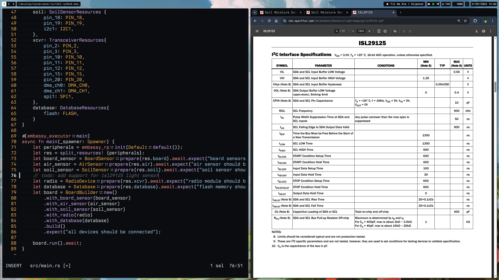

# Preview




# Overview 

This repo represents uniform structure that describes software/hardware configuration files based
on nix package manager, flakes and home-manager. 
It unlocks ability to reproduce my personalized setup on any linux/darwin based host without any time-consuming hassle.

## Motivation

Setting up your favorite environment on new machine is a time-consuming task,
furthermore if you want to keep them all in sync between machines then it's even more time-consuming,
eventually I got tired of configuring and installing everything again until I found NixOS, and it's declarative ecosystem.
It's a big pleasure to be able to define the whole system configuration
such as hardware and software in just one repo.

## Software

List of software that I prefer in my daily life and work workflows, I prefer to use software
written in languages that understand, so I can explore those solutions and contribute if needed.
Also, I'm huge fan of rust written apps I and believe there is no better alternative right now.

### TUI

| name          | description                  | language |
|---------------|------------------------------|----------|
| tuigreet      | console greeter              | rust     |
| ghostty       | terminal emulator            | zig      |
| nushell       | shell                        | rust     |
| starship      | cross-shell prompt           | rust     |
| btop          | a monitor of resources       | c++      |
| yazi          | terminal file manager        | rust     |
| p7zip         | file archiver                | rust     |
| ripgrep       | search tool                  | rust     |
| scooter       | interactive find-and-replace | rust     |
| dua-cli       | disk usage analyzer          | rust     |
| systemctl-tui | systemd services             | rust     |
| gitui         | git tui                      | rust     |

### GUI

| name            | description                               | language |
|-----------------|-------------------------------------------|----------|
| niri            | scrollable-tiling wayland compositor      | rust     |
| ironbar         | gtk bar for wayland                       | rust     |
| fuzzel          | app launcher and fuzzy finder for wayland | c        |
| pcmanfm         | file manager                              | c        |
| swww            | wallpaper daemon                          | rust     |
| wayidle         | wayland idle timeout listener             | rust     |
| waylock         | screenlocker                              | zig      |
| slurp           | region selector for wayland               | c        |
| wl-screenrec    | screen recording                          | rust     |
| wl-clipboard-rs | clipboard                                 | rust     |

### Development

| name          | description                            | language |
|---------------|----------------------------------------|----------|
| helix         | post-modern vim-like modal text editor | rust     |
| intellij idea | java ide                               | java     |
| zed           | rust ide                               | rust     |

### Other

| name             | description        | language   |
|------------------|--------------------|------------|
| stylix           | theming            | nix        |
| telegram-desktop | messenger          | c++        |
| discord          | messenger          | javascript |
| google-chrome    | browser            | c/c++      |
| gimp3            | image manipulation | c          |
| obsidian         | note taking        | javascript |
| berkeley-mono    | font               |            |
| nerd-icons       | icons              |            |


## Hardware

I do have a dell laptop with nixos and macbook pro with macos, so this config supports both linux and darwin targets.

# Prerequisites

## [nix](https://github.com/DeterminateSystems/nix-installer)

```shell
curl -fsSL https://install.determinate.systems/nix | sh -s -- install
```

## [nix-darwin](https://github.com/nix-darwin/nix-darwin)

```shell
sudo nix run nix-darwin/master#darwin-rebuild -- switch
```

## experimental features enabled

* nix-command
* flakes

# Getting Started

## Installation

```shell
git clone git@github.com:nanobreaker/nix-config.git ~/.config/nix-config
```

## Check
```shell
nix flake check
```

## Build

#### Linux 
```shell
sudo nixos-rebuild switch --flake .#nixos
```

### Darwin
```shell
sudo darwin-rebuild switch --flake .#darwin
```

## Keybinds

Here I will list my keybinds across all the programs, so I can easily look them up later
and perform some analysis on how create non-intersecting layouts for different programs.

# Licensing

The code in this project is licensed under MIT license. Check [LICENSE](LICENSE.md) for further
details.
